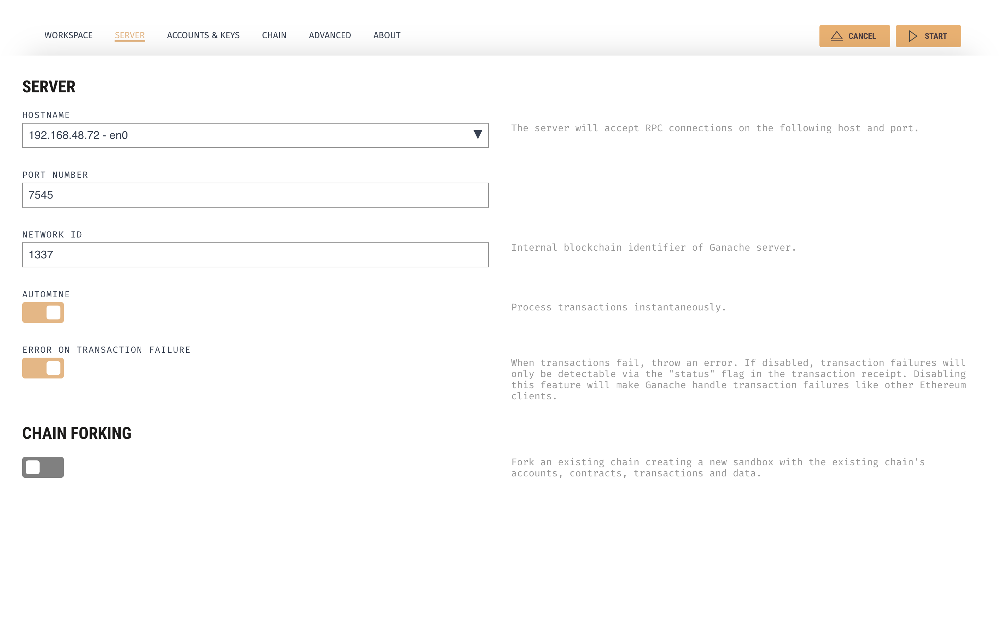

# 🏗 Scaffold-ETH

🧪 An open-source, up-to-date toolkit for building decentralized applications (dapps) on the Ethereum blockchain. It's designed to make it easier for developers to create and deploy smart contracts and build user interfaces that interact with those contracts.

⚙️ Built using React Native, Hardhat, Wagmi, Viem, and Typescript.

- 💳 **In-Built Wallet**: A safe and secure crypto wallet to manage funds, sign transactions and messages on multiple EVM compatible chains.
- ✅ **Contract Hot Reload**: Your frontend auto-adapts to your smart contract as you edit it.
- 🪝 **Custom hooks**: Collection of React hooks to simplify interactions with smart contracts with typescript autocompletion.
- 🧱 **Components**: Collection of common web3 components to quickly build your frontend.

<p align="center">

</p>

## Requirements

Before you begin, you need to install the following tools:

- Yarn ([v1](https://classic.yarnpkg.com/en/docs/install/) or [v2+](https://yarnpkg.com/getting-started/install))
- [Git](https://git-scm.com/downloads)
- [React Native](https://reactnative.dev/docs/environment-setup?guide=native&platform=android)
- [Ganache](https://archive.trufflesuite.com/ganache/)

## Quickstart

To get started with Scaffold-ETH 2, follow the steps below:

1. Clone this repo & install dependencies

```
git clone https://github.com/ValentineCodes/scaffold-eth-react-native.git

cd scaffold-eth-react-native

yarn install && yarn patch-ethers
```

Remember to run `yarn patch-ethers` to patch ethers after installing any package

2. Connect your device to your computer via WIFI-HOTSPOT

3. Open Ganache and create a new workspace with the following server configurations:

- HOSTNAME - your local IP address
- PORT NUMBER - 7545
- NETWORK ID - 1337

<p align="center">

</p>

4. Update the `deployerPrivateKey` in `packages/hardhat/hardhat.config.ts` to one of the accounts in your ganache workspace and the ganache network url to the local IP address

5. Deploy the test contract:

```
yarn deploy
```

6. Set the `ALCHEMY_KEY` and `LOCAL_PROVIDER` variables in `packages/reactnative/src/utils/constants.ts`

7. Connect your device via USB or Run an emulator

8. Run android(`IOS support coming soon...`):
```
yarn android
```

9. Import one of the accounts in your ganache workspace into your wallet to have funds for testing

You can interact with your smart contract using the `Debug Contracts` tab. You can tweak the app config in `packages/reactnative/scaffold.config.ts`.

Run smart contract test with `yarn hardhat:test`

- Edit your smart contract `YourContract.sol` in `packages/hardhat/contracts`
- Edit your frontend in `packages/reactnative/src/screens`
- Edit your deployment scripts in `packages/hardhat/deploy`

## Contributing to Scaffold-ETH

We welcome contributions to Scaffold-ETH!

Please see [CONTRIBUTING.MD](https://github.com/ValentineCodes/scaffold-eth-react-native/blob/main/CONTRIBUTING.md) for more information and guidelines for contributing to Scaffold-ETH.
