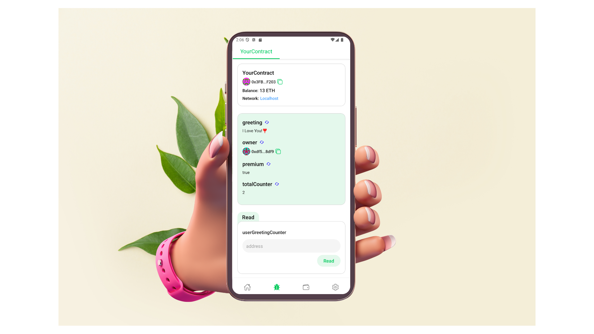

# 🧠 Think → 👨‍💻 Build → 🚀 Deploy

✍️ **Scaffold-ETH-Mobile** is an open-source toolkit for building decentralized applications (dApps) on Ethereum and other EVM-compatible blockchains. It simplifies mobile dApp development with fast, secure and customizable pre-built components to create, deploy and interact with smart contracts.

[Watch me mint a Snowman NFT!☃️](https://youtu.be/CaJTnRtLOK8)

⚙️ **Tech Stack**: Built with React Native, Hardhat, Ethers, and TypeScript to streamline mobile dApp development.

### Key Features

- 🧑‍💻 **Contract Debugger**: Inspect smart contract details such as address, balance, variables, and functions. It also allows real-time interaction with contracts, making development more efficient.



- 💳 **In-Built Wallet**: A secure mobile crypto wallet for managing funds, signing transactions, and interacting with multiple EVM-compatible chains.


- ✅ **Contract Hot Reload**: Automatically updates the mobile frontend to reflect changes made to smart contracts during development.
- 🪝 **Custom Hooks**: A collection of React hooks with TypeScript autocompletion, simplifying contract interaction in your mobile app.
- 🧱 **Web3 Components**: Pre-built components for quickly building mobile dApp frontends.

## Requirements

Before you begin, you need to install the following tools:

- Yarn ([v1](https://classic.yarnpkg.com/en/docs/install/) or [v2+](https://yarnpkg.com/getting-started/install))
- [Git](https://git-scm.com/downloads)
- [React Native](https://reactnative.dev/docs/environment-setup?guide=native&platform=android)
- [Yeet CLI](https://npmjs.com/package/yeet-cli)

## Quickstart

To get started, follow the steps below:

1. Clone this repo & install dependencies

```
git clone https://github.com/ValentineCodes/scaffold-eth-mobile.git

cd scaffold-eth-mobile

yarn install

cd packages/reactnative

npx pod-install
```

2. Connect your device to your computer via WIFI-HOTSPOT

3. Run a local network in the first terminal

```
yarn chain
```

This command starts a local Ethereum network hosted on your local IP address. The network runs on your local machine and can be used for testing and development. You can customize the network configuration in `hardhat.config.ts`.

Alternatively, you can use [Ganache](https://archive.trufflesuite.com/ganache/) to persist the blockchain state during development

4. On a second terminal, deploy the test contract:

```
yarn deploy
```

This command deploys a test smart contract to the local network. The contract is located in `packages/hardhat/contracts` and can be modified to suit your needs. The `yarn deploy` command uses the deploy script located in `packages/hardhat/deploy` to deploy the contract to the network. You can also customize the deploy script.

5. Set the `ALCHEMY_KEY` and `localhost.provider`(port **8545**) variables in `packages/reactnative/scaffold.config.ts`

#### To determine your local IP address:

#### Mac:

```
ipconfig getifaddr en0
```

#### Windows:

```
ipconfig
```

6. Connect your device via USB or Run an emulator

7. Run on device:

#### Android

```
yarn android
```

#### IOS

```
yarn ios
```

8. Import one of the funded accounts in your local blockchain into your wallet to have funds for testing

You can interact with your smart contract using the `DebugContracts` tab. You can configure your supported networks in `packages/reactnative/scaffold.config.ts`.

Run smart contract test with `yarn hardhat:test`

- Edit your smart contract `YourContract.sol` in `packages/hardhat/contracts`
- Edit your frontend in `packages/reactnative/src/screens`
- Edit your deployment scripts in `packages/hardhat/deploy`

## Contributing to Scaffold-ETH-Mobile

We welcome contributions to Scaffold-ETH-Mobile!

Please see [CONTRIBUTING.MD](https://github.com/ValentineCodes/scaffold-eth-mobile/blob/main/CONTRIBUTING.md) for more information and guidelines for contributing to Scaffold-ETH.
