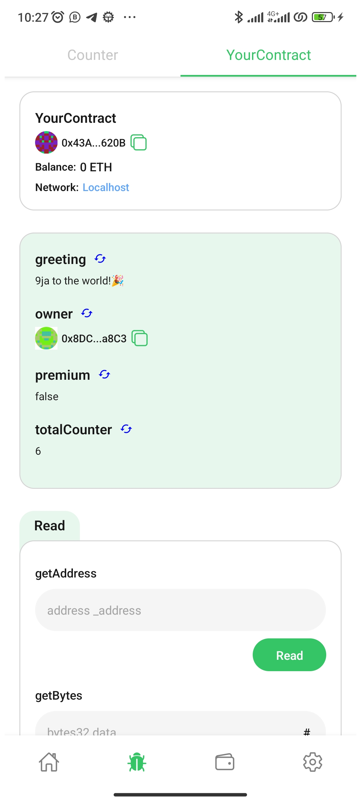

# 🏗 Scaffold-ETH

🧪 An open-source, up-to-date toolkit for building decentralized applications (dapps) on the Ethereum blockchain. It's designed to make it easier for developers to create and deploy smart contracts and build user interfaces that interact with those contracts.

⚙️ Built using React Native, Foundry, Wagmi, Viem, and Typescript.

- 💳 **In-Built Wallet**: A safe and secure crypto wallet to manage funds, sign transactions and messages on multiple EVM compatible chains.
- ✅ **Contract Hot Reload**: Your frontend auto-adapts to your smart contract as you edit it.
- 🪝 **Custom hooks**: Collection of React hooks to simplify interactions with smart contracts with typescript autocompletion.
- 🧱 **Components**: Collection of common web3 components to quickly build your frontend.

<p align="center">

</p>

## Requirements

Before you begin, you need to install the following tools:

- Yarn ([v1](https://classic.yarnpkg.com/en/docs/install/) or [v2+](https://yarnpkg.com/getting-started/install))
- [Git](https://git-scm.com/downloads)
- [React Native](https://reactnative.dev/docs/environment-setup?guide=native&platform=android)

## Quickstart

To get started with Scaffold-ETH 2, follow the steps below:

1. Clone this repo & install dependencies

```
git clone https://github.com/ValentineCodes/scaffold-eth-react-native.git

cd scaffold-eth-react-native

git checkout foundry

yarn install && yarn patch-ethers

cd packages/foundry

foundryup

cd ../reactnative

npx pod-install
```

Remember to run `yarn patch-ethers` to patch ethers after installing any package

2. Connect your device to your computer via WIFI-HOTSPOT

3. Run a local network in the first terminal
```
yarn chain
```

This command starts a local Ethereum network hosted on your local IP address. The network runs on your local machine and can be used for testing and development. You can customize the network configuration in `foundry.toml`.

4. On a second terminal, deploy the test contract:

```
yarn deploy
```

This command deploys a test smart contract to the local network. The contract is located in `packages/foundry/contracts` and can be modified to suit your needs. The `yarn deploy` command uses the deploy script located in `packages/foundry/script/Deploy.s.sol` to deploy the contract to the network. You can also customize the deploy script.

5. Set the `ALCHEMY_KEY` and `LOCAL_PROVIDER`(port **8545**) variables in `packages/reactnative/src/utils/constants.ts`

#### To determine your local IP address:

#### Mac:
```
ipconfig getifaddr en0
```

#### Windows: 
```
ipconfig
```


6. Connect your device via USB or Run an emulator

7. Run on device:

#### Android
```
yarn android
```

#### IOS
```
yarn ios
```

8. Import one of the funded accounts in your local blockchain into your wallet to have funds for testing

You can interact with your smart contract using the `Debug Contracts` tab. You can tweak the app config in `packages/reactnative/scaffold.config.ts`.

Run smart contract test with `yarn test`

- Edit your smart contract `YourContract.sol` in `packages/foundry/contracts`
- Edit your frontend in `packages/reactnative/src/screens`
- Edit your deployment scripts in `packages/foundry/script/Deploy.s.sol`

## Contributing to Scaffold-ETH

We welcome contributions to Scaffold-ETH!

Please see [CONTRIBUTING.MD](https://github.com/ValentineCodes/scaffold-eth-react-native/blob/main/CONTRIBUTING.md) for more information and guidelines for contributing to Scaffold-ETH.
